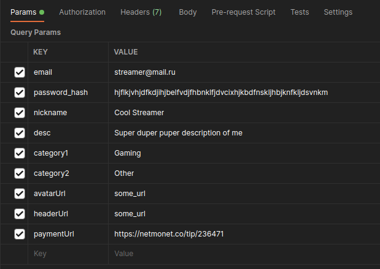

# Запуск backend

## Установка JDK

---

**Убедитесь, что у Вас установлена 17 версия JDK!!**

Ссылка на скачивание JDK 17:
https://www.oracle.com/java/technologies/javase/jdk17-archive-downloads.html

После установки JDK 17 открываем терминал и проверяем её наличие.

```
$ java --version
```

Появится информация об установленных версиях Java.

## Настройка базы данных PostgreSQL

---

### Устанавливаем `postgresql`

```
$ sudo apt update
$ sudo apt install postgresql
...
```

### Создаём базу данных

- Хост: `localhost`
- Порт: `5432`
- Владелец: `postgres`
- Название `reddonatedb`

```
$ create -h localhost -p 5432 -U postgres reddonatedb
```

Появится надпись

```
Password:
```

где мы вводим пароль `root`

## Установка пакетов для запуска

---

### Устанавливаем `maven`

```
$ sudo apt update
$ sudo apt install maven
...
```

### Собираем проект

```
$ mvn package
...
$ mvn compile
...
```

Теперь можно его запускать

## Запуск проекта

```
$ java -jar ./target/RedDonate-0.0.1-SNAPSHOT.jar
```

# Небольшая пометка!!!!

---

## Так как сейчас у нас авторизация не реализована, Вам, чтобы полностью просмотреть остальную реализацию понадобится добавить несколько пользователей вручную..

## Ссылка для добавления: (метод POST)

```
http://localhost:8081/users/createUser?email=streamer@mail.ru&password_hash=hjflkjvhjdfkdjihjbelfvdjfhbnklfjdvcixhjkbdfnskljhbjknfkljdsvnkm&nickname=Cool Streamer&desc=Super duper puper description of me&category1=Gaming&category2=Other&avatarUrl&headerUrl&paymentUrl=https://netmonet.co/tip/236471
```

## Параметры для создания пользователя:



# _Думаю удобнее всего будет добавлять их через Postman :)_